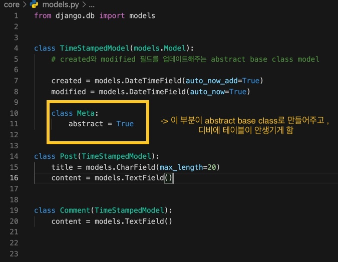
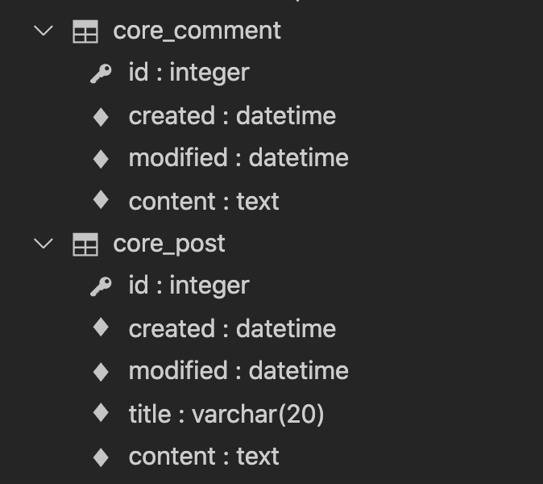

# Model - Basic

>  `챕터 6` (63p ~)

## ⭑ 기본

		#### 	기본.1 - 하나의 앱에 모델이 너무 많으면 작은 앱을 쪼개라

---

- 앱 하나 당 5~10개 정도의 모델을 가지고 있는 것이 좋다.

  (나는 앱이 아니라 프로젝트 전체에서 사용되는 앱이 20개도 안돼서 이런 경우가 없었지만ㅋㅋ 모델이 너무 많아지면 쪼개자 당연한 소리..)

#### 	기본.2 모델 상속시 주의해라

---

- 장고에서는  `abstract base classes`, `multi-table inheritance`, `proxy models`   세 가지 모델 상속 타입을 제공한다.

	 - 그 중에서도 `Multi-table inheritance` (concrete inheritance) 사용을 피해라!
	 - 작가와 다른 개발자들에 의해서 bad thing으로 간주된다고 한다.
	 - 정말 정말 쓰지말아라.

  ####  	기본.3 Model Inheritance 실습

---

	> 이 책에서는 실습 부분이 abstract base class 밖에 없고 , 공식문서 링크에서 더 많은 것을 참조하라고 나와있다. 나는 이 책의 하나가 흐름을 잘 이해하지 못하겠다.. 보통 세 가지 있다고 하면 세 가지 다 실습해줘야하지 않나?? 하나 알려주고 나머지는 공식문서 보라고하면 어쩌라는 것? 그럼 하나도 알려주지 말고 세 가지 다 공식문서 보라고하지?? 어쨌든 나는 하나만 실습하고 가기는 찝찝하기 때문에 내가 알아서 세 가지 실습을 하고 정리하겠다. 

#### ✏️1. Abstract base classes

  - abstract parent 클래스가 다른 모델에서 사용될 공통적인 필드를 가지고 있으면, 우리가 타이핑하는 것을 줄여준다

  - 실례로, 모델에 `created` , `modified` 필드를 넣는 것은 정말 흔하다. 일일이 모든 모델에 이 필드들을 추가할 수도 있지만, 더 좋은 방법이 있다.

    

    

    

- 위와 같이 TimeStampedModel 를 만들고 abstract base class 로 정의해주면, 장고는 migrate 할 때 이 클래스의 테이블을 생성하지 않는다.

- 위의 예시에서는 세 가지 테이블이 아니라, 두 가지 테이블, Post, Comment만 생성된다. 

- Parent 클래스의 필드들이 Child class인 Post와 Comment에 (created, modified)  추가되었다.

  

  

---

#### ✏️ 2. Multi-table-inheritance 

​	

#### ✏️ 3. Proxy models

### ⭑ 데이터베이스 마이그레이션(DB)

#### DB.1 - Migration 시 팁

---

- 새 앱이나 모델을 만들고 makemigrations 을 바로 해라
- migrate전에 생선된 migrations 코드를 확인해라
- migration 전에 데이터를 백업하라

#### DB.2 - Migrations 에 파이썬 함수와 커스텀 SQL을 더하라

#### DB.3 - Overcoming Common OBstacles of RunPython

#### DB.4 - 장고 모델 디자인 (70p ~)

---

1. 정규화하기

   - 정규화에 대한 설명은 생략

   - 다른 모델이 가진 데이터를 가지지 않게 하기

2. 비정규화하기전에 캐시하기

   

3. 정말 필요할때만 비정규화하기

   

4. 언제 Null과 Blank 를 사용할지 생각하기

   

5. 언제 BinaryField를 사용할지 생각하기

6. Generic Relations 사용을 지양하기.

7. 

