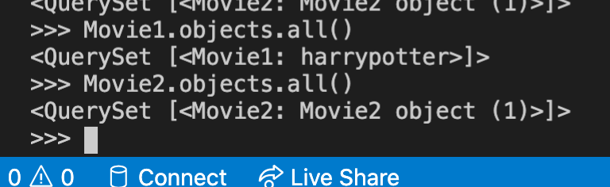
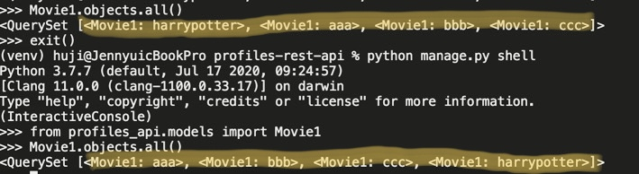

### Model

---

- 모델이란 테이블을 정의하는 장고의 `클래스` 를 의미한다. models.py 파일에는 기본적으로 테이블을 정의하지만, 장고는 ORM 방식에 기반하기 때문에, 클래스의 특징인 `변수` 와 `메소드` 를 가질 수 있다. 
- 따라서 테이블을 정의할 때, 관련 변수와 메소드도 함께 정의할 수 있다. 테이블에 관련된 데이터와 행위를 모두 모델 클래스 한 곳에서 정의할 수 있다.


### 모델 속성

---

모델의 필드는 테이블의 컬럼으로 1:1 매핑된다.

필드를 정의할 때는 `필드명`,  `필드타입`,  `필드옵션`을 지정해주어야 한다.

모델 필드 부분은 비교적 간단하므로 필기하지 않고 넘어가겠다.


### 모델 메소드

---

- 앞서 얘기한 것처럼, 모델 클래스에 메소드를 정의할 수 있다. 이 때, 크래스 메소드와 객체 메소드를 구분해야한다. `클래스메소드` 는 테이블 레벨에서 동작하는 메소드이고, `객체 메소드` 는 레코드 레벨에서 동작하는 메소드이다.
-  장고에서는 객체 메소드만 사용한다. 즉, 모델 클래스에 정의하는 메소드는 모두 객체 메소드이고 항상 `self 인자` 를  가지고 있으며, 이 메소드를 호출하면 테이블 단위가 아니라 레코드 단위에 영향을 미친다. 
- 장고는 클래스 메소드를 사용하지 않기 때문에, 테이블 단위의 동작을 하기 위해서는(e.g. 테이블의 모든 레코드 수 카운트) `Manager` 클래스를 사용한다. 매니저 클래스의 메소드를 통해서 테이블에 대한 CRUD 동작을 수행한다. 


> 자주 사용하는 <객체 메소드>
>
> 1. `__str__` 
>
>    : 객체의 문자열 표현을 리턴. 객체는 모두 파이썬의 내부 포맷으로 저장되므로 우리가 읽을 수 없는데, 이런 객체를 쉽게 읽을 수 있게 문자열로 표현한다. 디폴트 `__str__()` 메소드는 이해하기 어려우므로 오버라이딩해서 정의해주는 것이 좋다.
>
>    ```python
>    class Movie1(models.Model):
>        title = models.CharField(max_length=50)
>    
>        def __str__(self):
>            return self.title
>    
>    
>    class Movie2(models.Model):
>        title = models.CharField(max_length=50)
>    ```
>
>    
>
>    해리포터 타이틀이 보이고 안보이고 차이가 굉장히 크다.
>
>    
>
> 2.  `get_absolute_url()` 
>
>    : 객체를 지칭하는 URL을 반환한다. URLconf에서 DetailView 제네릭 뷰를 사용하는 경우가 좋은 예이다.
>
> 


### Meta 내부 클래스 속성

---

: Meta 내부 클래스를 정의해 모델에 대한 메타데이터를 정의할 수 있다. 모델의 필드는 아니지만, 필요한 항목을 Meta 내부 클래스에 정의한다. 쉽게 말하면 필드는 모델의 속성으로, 필드 이외 항목은 Meta 내부 클래스의 속성으로 정의한다. Meta 내부 클래스의 속성으로 자주 사용하는 항목들은 다음과 같다.


### 1. `ordering`

: 모델 객체를 리스트로 출력할 때(DB에서 가져올 때) 정렬할 기준 필드명을 지정한다. 지정한 필드명을 기준으로 디폴트 오름차순이고, `-` 를 붙이면 내림차순이다. 



 		첫 부분이 ordering 적용 전(저장 순서대로 출력), 다음 부분이 ordering 적용 후(title순서로 출력)이다


### 2. `db_table`

: 데이터베이스에 저장되는 테이블 이름을 지정한다. 디폴트 값은 `앱 이름_클래스 이름` 이다.

db_table = '원하는이름' 

으로 디폴트 테이블 명을 변경할 수 있다. 

### 3. `verbose_name`

: 사용자가 이해하기 쉬운 모델 객체의 별칭이다. 이 항목을 지정하지 않으면 장고가 모델 클래스명을 이용해서 알아서 만든다. (e.g. 모델 클래스 이름이 FavoritePost 이면 favorite post 로)

디폴트 별칭을 변경하고 싶으면 verbose_name = '내가 부르고 싶은 이름' 으로 메타 항목을 지정하면 된다.

### 기타

: 이외에도 약 20가지의 메타항목이 있다. 공식문서를 참조하자.


### Manager 속성

---

- 모든 모델은 반스시 Manager 속성을 지닌다. 
- 모델을 정의할 때 지정하지 않으면 Manager속성의 디폴트 이름은 `objects` 이다. 매니저 속성은 모델 클래스를 통해서만 접근할 수 있고, 모델 객체를 통해서는 접근할 수 없다.
- Manager 속성은 models.Manager 타입으로 정의된다. Manager 클래스를 통해 데이터베이스 쿼리가 이루어 진다.
- 즉, 테이블 레벨의 동작은(레코드 레벨 nono) Manager 클래스의 메소드를 통해 이루어진다.

```python
Movie.objects.all()
/// Movie -> 모델 객체 x, 모델 클래스 o
/// objects -> Manager 속성 이름
/// all() -> Manager 클래스 메소드
```

- 모델 클래스에서 Manager 속성을 여러 개 정의할 수 있다.


